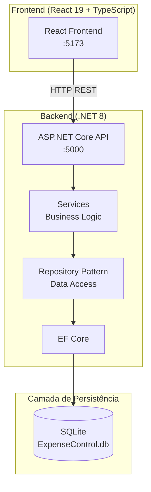

# 💰 Sistema de Controle de Gastos Residenciais

Sistema full-stack para controle de gastos residenciais — cadastro de pessoas, transações financeiras (receitas e despesas) e consulta de totais consolidados.

> **Status do projeto:** ✅ Funcional e testado — **139 testes (92 backend + 47 frontend), 100% passando** + 5 testes E2E (Playwright).  
> **Contexto:** Desafio técnico de desenvolvimento full-stack.  
> **Especificação original:** [desafio.md](desafio.md)

---

## 📋 Índice

- [Visão geral](#-visão-geral)
- [Arquitetura](#-arquitetura)
- [Funcionalidades e regras de negócio](#-funcionalidades-e-regras-de-negócio)
- [Tecnologias](#-tecnologias)
- [Estrutura do projeto](#-estrutura-do-projeto)
- [Como executar](#-como-executar)
- [API — Endpoints](#-api--endpoints)
- [Testes](#-testes)
- [Documentação complementar](#-documentação-complementar)
- [Design decisions](#-design-decisions)
- [Critérios de avaliação atendidos](#-critérios-de-avaliação-atendidos)

---

## 🏗️ Visão geral

O sistema resolve o problema de **controle financeiro doméstico** permitindo que uma residência acompanhe receitas e despesas por pessoa, com consolidação automática de saldos individuais e total geral.



### Fluxo de dependências (injeção)

```
Controller → Service → IRepository⟨T⟩ → Repository⟨T⟩ → DbContext → SQLite
     ↑            ↑              ↑
   valida       regra de      abstração de
   HTTP         negócio       acesso a dados
```

---

## 🏛️ Arquitetura

O backend segue uma **arquitetura em camadas** com princípios SOLID:

| Camada | Responsabilidade | Exemplo |
|--------|-----------------|---------|
| **Controllers** | Receber requisições HTTP, validar entrada, retornar status codes | `PeopleController` |
| **Services** | Regras de negócio, orquestração | `TransactionService` (bloqueia receita para menores) |
| **Repository** | Abstração de acesso a dados (padrão Repository genérico) | `IRepository⟨Person⟩` / `Repository⟨Person⟩` |
| **DbContext** | Mapeamento objeto-relacional, migrações, relacionamentos | `AppDbContext` |
| **Models** | Entidades do domínio | `Person`, `Transaction` |

### Por que separar Controller → Service → Repository?

| Motivo | Explicação |
|--------|-----------|
| **Testabilidade** | Cada camada pode ser testada isoladamente. O Service não sabe se os dados vêm de SQLite, PostgreSQL ou memória — depende apenas de `IRepository⟨T⟩`. |
| **Reusabilidade** | As regras de negócio no Service valem para qualquer canal (REST API, CLI, job em background). |
| **Manutenibilidade** | Trocar o banco de dados? Altera apenas o Repository. Mudar a regra de idade mínima? Altera apenas o Service. |
| **Single Responsibility** | Cada classe tem um motivo claro para existir. |

---

## 📋 Funcionalidades e regras de negócio

### 👥 Cadastro de Pessoas

| Operação | Descrição |
|----------|-----------|
| **Criar** | `POST /api/people` — nome (obrigatório, máx. 100 caracteres) + idade (obrigatório, 0–150) |
| **Listar** | `GET /api/people` — retorna todas as pessoas ordenadas por nome |
| **Remover** | `DELETE /api/people/{id}` — remove a pessoa e **todas as suas transações** (cascata) |

### 💳 Cadastro de Transações

| Operação | Descrição |
|----------|-----------|
| **Criar** | `POST /api/transactions` — descrição, valor (> 0), tipo (`receita`\|`despesa`), pessoa |
| **Listar** | `GET /api/transactions` — ordenadas da mais recente para a mais antiga |

> ⚠️ **Regra de negócio crítica:** menores de 18 anos só podem cadastrar **despesas**.  
> Tentar criar uma receita para um menor resulta em **HTTP 400** com mensagem explicativa.

### 📊 Consulta de Totais

| Operação | Descrição |
|----------|-----------|
| **Consultar** | `GET /api/totals` — retorna receitas, despesas e saldo por pessoa + total geral |

---

## 🛠 Tecnologias

| Camada | Stack | Versão | Justificativa |
|--------|-------|--------|---------------|
| **Backend runtime** | .NET | 8.0 (LTS) | Suporte de longo prazo, performance, ecossistema maduro |
| **API framework** | ASP.NET Core | 8.0 | Minimal APIs ou Controllers; Swagger integrado |
| **ORM** | Entity Framework Core | 8.0 | Mapeamento objeto-relacional, migrations, LINQ |
| **Banco de dados** | SQLite | — (via EF Core) | Zero configuração, arquivo local, ideal para MVPs e testes |
| **Frontend framework** | React | 19 | Ecossistema dominante, componentização, hooks |
| **Linguagem frontend** | TypeScript | ~6.0 | Tipagem estática, segurança em tempo de compilação |
| **Bundler** | Vite | 8 | Build instantâneo, HMR, nativo para ES modules |
| **Testes backend** | xUnit + EF Core InMemory | 2.5 / 8.0 | Framework padrão .NET; InMemory simula SQLite sem I/O |
| **Testes integração** | WebApplicationFactory | 8.0 | Sobe a API real em memória para testes HTTP |
| **Testes frontend** | Vitest + Testing Library | 4 / 16 | Nativo do Vite, compatível com API do Jest |
| **Linting** | oxlint | 1 | Linter rápido para TypeScript/React |

---

## 📁 Estrutura do projeto

```
desafio-expense-control-system/
│
├── README.md                          ← Este arquivo
├── SETUP.md                           ← Guia de instalação e configuração
├── TESTING.md                         ← Documentação completa da suite de testes
├── IMPROVEMENTS.md                    ← Plano de melhorias e qualidade
├── desafio.md                         ← Especificação original do desafio
│
├── backend/                           ← API .NET 8
│   ├── Backend.sln                    ← Solution file
│   ├── Backend.csproj                 ← Projeto principal
│   ├── Program.cs                     ← Bootstrap: DI, middleware, CORS, DB init
│   ├── appsettings.json               ← Configuração (connection string)
│   ├── appsettings.Development.json
│   │
│   ├── Controllers/                   ← Endpoints REST
│   │   ├── PeopleController.cs        ← CRUD de pessoas
│   │   ├── TransactionsController.cs  ← Criação e listagem de transações
│   │   └── TotalsController.cs        ← Consulta de totais
│   │
│   ├── Services/                      ← Lógica de negócio
│   │   ├── PersonService.cs           ← CRUD de pessoas + obtenção de idade
│   │   ├── TransactionService.cs      ← Validação de idade + criação de transações
│   │   └── TotalsService.cs           ← Cálculo de totais por pessoa e geral
│   │
│   ├── Data/                          ← Acesso a dados
│   │   ├── AppDbContext.cs            ← DbContext + configuração de relacionamentos
│   │   ├── IRepository.cs             ← Interface do Repository Pattern (genérico)
│   │   └── Repository.cs              ← Implementação genérica do Repository
│   │
│   ├── Models/                        ← Entidades do domínio
│   │   ├── Person.cs                  ← Id, Name, Age, Transactions
│   │   └── Transaction.cs             ← Id, Description, Amount, Type, PersonId
│   │
│   └── DTOs/                          ← Contratos de entrada/saída da API
│       └── Dtos.cs                    ← Create/Response DTOs para Person, Transaction, Totals
│
├── frontend/                          ← React 19 + TypeScript + Vite
│   ├── package.json
│   ├── vite.config.ts                 ← Config do Vite + Vitest
│   ├── tsconfig.json                  ← Config base do TypeScript
│   ├── tsconfig.app.json
│   ├── tsconfig.node.json
│   ├── index.html
│   │
│   └── src/
│       ├── main.tsx                   ← Ponto de entrada React
│       ├── App.tsx                    ← Componente principal (3 abas: Pessoas, Transações, Totais)
│       ├── App.css                    ← Estilos globais e componentes
│       ├── index.css                  ← Reset e estilos base
│       ├── test-setup.ts              ← Config do ambiente de teste (jest-dom matchers)
│       │
│       ├── api/
│       │   └── index.ts              ← Cliente HTTP (fetch wrapper + funções para cada endpoint)
│       │
│       ├── types/
│       │   └── index.ts              ← Interfaces TypeScript (Person, Transaction, Totals, DTOs)
│       │
│       └── __tests__/
│           ├── api.test.ts            ← Testes unitários da camada de API (mock fetch, 17 testes)
│           ├── App.test.tsx           ← Testes de componente React (renderização, navegação, 24 testes)
│           └── contract.test.ts       ← Testes de contrato com contracts/api-contract.json (6 testes)
│
└── tests/                             ← Testes automatizados
    └── backend/
        ├── Backend.Tests.csproj       ← Projeto de testes (xUnit + InMemory + WebApplicationFactory)
        ├── TestDatabase.cs            ← Helper para criar DbContext em memória
        ├── TestWebApplicationFactory.cs ← Factory para testes de integração
        │
│        ├── Unit/                      ← Testes unitários (47 testes)
        │   ├── PersonServiceTests.cs
        │   ├── TransactionServiceTests.cs
        │   ├── TotalsServiceTests.cs
        │   ├── ExceptionHandlingMiddlewareTests.cs
        │   └── RepositoryTests.cs
        │
│        └── Integration/               ← Testes de integração (45 testes)
            ├── PeopleControllerTests.cs
            ├── TransactionsControllerTests.cs
            ├── TotalsControllerTests.cs
            └── ContractTests.cs       ← Contrato da API (contracts/api-contract.json)
```

---

## 🚀 Como executar

### Pré-requisitos

| Ferramenta | Versão | Como verificar |
|-----------|--------|----------------|
| .NET SDK | 8.0+ | `dotnet --version` |
| Node.js | 18+ | `node --version` |
| npm | 9+ | `npm --version` |

### Backend

```bash
cd backend
dotnet run
# ▶ API:    http://localhost:5000
# ▶ Swagger: http://localhost:5000/swagger
```

O banco SQLite (`ExpenseControl.db`) é criado automaticamente na primeira execução. Nenhuma configuração manual de banco é necessária.

### Frontend

```bash
cd frontend
npm install
npm run dev
# ▶ App: http://localhost:5173
```

### Guia completo de setup

Consulte [SETUP.md](SETUP.md) para:
- Instalação passo a passo do .NET SDK
- Configuração do ambiente de desenvolvimento
- Guia para recriar o projeto do zero
- Troubleshooting de problemas comuns

---

## 🔌 API — Endpoints

| Método | Rota | Descrição | Status |
|--------|------|-----------|--------|
| `POST` | `/api/people` | Criar pessoa | `201 Created` |
| `GET` | `/api/people` | Listar pessoas (paginação: `page`/`pageSize`) | `200 OK` |
| `GET` | `/api/people/{id}` | Buscar pessoa | `200 OK` / `404 Not Found` |
| `DELETE` | `/api/people/{id}` | Remover pessoa | `204 No Content` / `404 Not Found` |
| `POST` | `/api/transactions` | Criar transação | `201 Created` / `400 Bad Request` |
| `GET` | `/api/transactions` | Listar transações (filtro por data + ordenação + paginação) | `200 OK` |
| `GET` | `/api/transactions/{id}` | Buscar transação | `200 OK` / `404 Not Found` |
| `PUT` | `/api/transactions/{id}` | Atualizar transação | `200 OK` / `400` / `404` |
| `DELETE` | `/api/transactions/{id}` | Remover transação | `204 No Content` / `404` |
| `GET` | `/api/totals` | Consultar totais | `200 OK` |

Consulte [API_REFERENCE.md](API_REFERENCE.md) para documentação detalhada com exemplos de request/response.

---

## 🧪 Testes

| Camada | Framework | Qtde. | Comando |
|--------|-----------|-------|---------|
| Backend — Unit | xUnit + EF Core InMemory | 47 | `cd tests/backend && dotnet test --filter "Unit"` |
| Backend — Integration | WebApplicationFactory | 45 | `cd tests/backend && dotnet test --filter "Integration"` |
| Frontend — API | Vitest + mock fetch | 17 | `cd frontend && npm test` |
| Frontend — Component | Vitest + Testing Library | 24 | `cd frontend && npm test` |
| Frontend — Contrato | Vitest (contracts/api-contract.json) | 6 | `cd frontend && npm test` |
| **TOTAL (unitário/integração)** | | **139** | |
| E2E — Playwright | Playwright + Chromium | 5 | `cd frontend && npm run test:e2e` |

```bash
# Executar tudo de uma vez
cd tests/backend && dotnet test && cd ../../frontend && npm test
```

Consulte [TESTING.md](TESTING.md) para a documentação completa da suite de testes.

---

## 📚 Documentação complementar

| Documento | Conteúdo |
|-----------|----------|
| [SETUP.md](SETUP.md) | Guia de instalação, configuração e troubleshooting |
| [API_REFERENCE.md](API_REFERENCE.md) | Referência completa dos endpoints REST |
| [TESTING.md](TESTING.md) | Documentação da suite de 139 testes |
| [IMPROVEMENTS.md](IMPROVEMENTS.md) | Plano de melhorias com priorização |
| [desafio.md](desafio.md) | Especificação original do desafio técnico |

---

## 🧠 Design decisions

> *"Por que vocês fizeram assim e não assado?"* — Aqui estão as respostas.

### Por que Repository Pattern genérico?

O projeto tem apenas 2 entidades (`Person`, `Transaction`), então um repositório genérico `IRepository⟨T⟩` / `Repository⟨T⟩` evita duplicação de código CRUD. Para queries específicas, a interface pode ser estendida sem quebrar o existente:

```csharp
// Extensão futura sem alterar código existente:
public interface IPersonRepository : IRepository<Person>
{
    Task<List<Person>> GetAdultsAsync();  // Nova query específica
}
```

### Por que `TransactionService` depende de `PersonService` (e não do `IRepository⟨Person⟩`)?

**Tell, Don't Ask.** `PersonService.GetAgeAsync(id)` encapsula "como obter a idade". Se no futuro a idade for calculada a partir da data de nascimento, só o `PersonService` muda — `TransactionService` permanece intacto.

### Por que as regras de negócio estão nos Services e não nos Controllers?

As regras valem independentemente do canal de entrada. Se amanhã surgir um CLI, um job batch ou uma message queue, as mesmas validações se aplicam. Controllers tratam HTTP; Services tratam negócio.

### Por que SQLite e não PostgreSQL/SQL Server?

Para um MVP ou desafio técnico, SQLite é ideal: zero configuração, sem servidor, sem instalação. O arquivo `.db` pode ser versionado ou descartado. A migração para PostgreSQL exigiria apenas trocar o provider no `Program.cs` — o resto do código (Services, Repository, Controllers) não muda.

### Por que Vitest e não Jest?

Vitest é nativo do ecossistema Vite (mesma config, mesma velocidade de build). Não exige Babel, `ts-jest` ou transformações adicionais. A API é compatível com Jest, então a curva de aprendizado é zero.

### Por que `Type` é string ("receita"/"despesa") e não enum?

Strings são auto-descritivas em JSON e evitam problemas de serialização/desserialização entre C# e TypeScript. A validação `[RegularExpression]` garante a integridade no backend. Para um sistema em produção, um enum com conversores personalizados seria mais adequado.

---

## ✅ Critérios de avaliação atendidos

| Critério | Como atendemos |
|----------|---------------|
| **Aderência às regras de negócio** | As 3 regras estão implementadas nos Services e cobertas por testes unitários e de integração |
| **Atenção aos detalhes** | Código comentado em português explicando o *porquê* de cada decisão; XML docs em todas as classes públicas |
| **Qualidade e legibilidade** | SOLID, Repository Pattern, DTOs, separação clara de responsabilidades, comentários que explicam "por que" e não "o que" |
| **Boas práticas** | Testes unitários + integração + componente, InMemory DB para testes, DI, CORS configurado, Swagger |

---

<p align="center">
  <sub>Desenvolvido como parte do processo seletivo para Estágio em TI.</sub>
</p>

## 🔌 Endpoints da API

| Método | Rota | Descrição |
|--------|------|-----------|
| `POST` | `/api/people` | Criar pessoa |
| `GET` | `/api/people` | Listar pessoas |
| `GET` | `/api/people/{id}` | Buscar pessoa |
| `DELETE` | `/api/people/{id}` | Remover pessoa (cascata) |
| `POST` | `/api/transactions` | Criar transação |
| `GET` | `/api/transactions` | Listar transações |
| `GET` | `/api/transactions/{id}` | Buscar transação |
| `GET` | `/api/totals` | Consultar totais |
